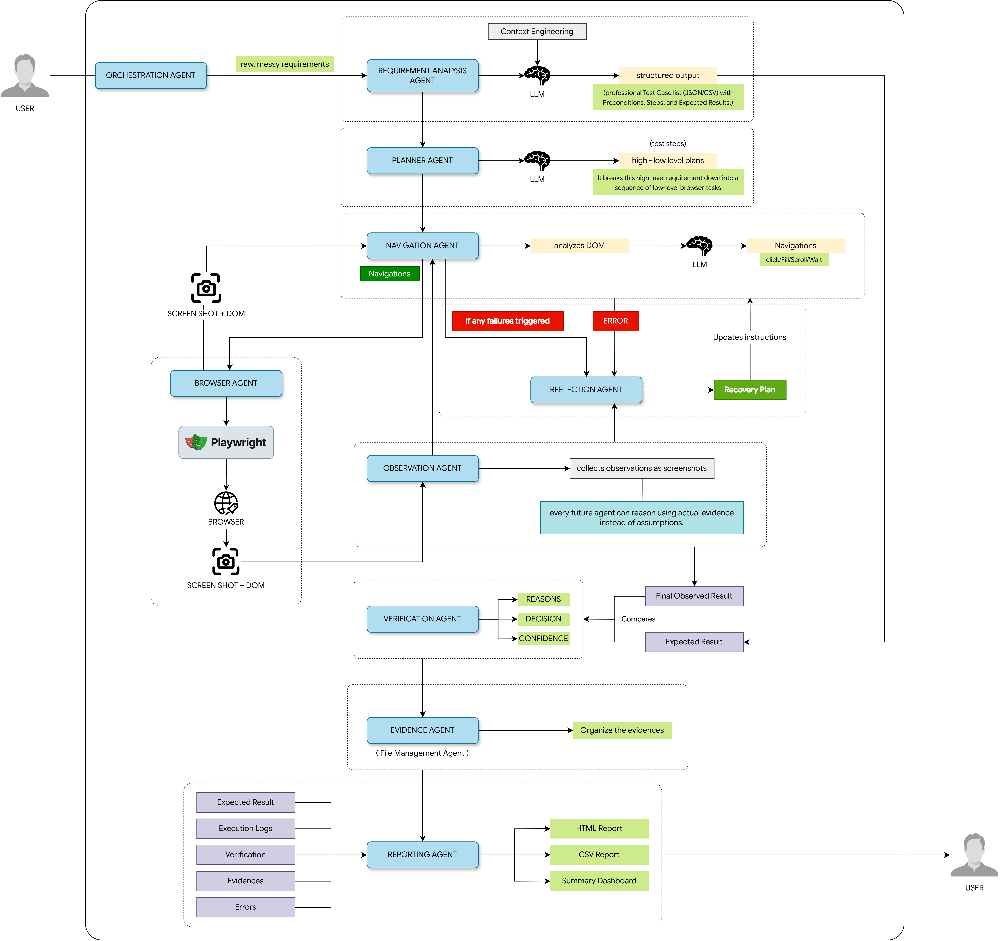

# AI Test Engineering Platform

An autonomous, multi-agent framework designed to automate the software testing lifecycle. Unlike traditional, brittle testing scripts (e.g., Selenium), this platform uses specialized AI agents that dynamically reason about the DOM, self-heal during navigation failures, and generate comprehensive HTML reports.

## System Architecture



### Low-Level Architecture Explanation

The platform is designed around a **Custom Multi-Agent Orchestration Framework**. It intentionally avoids heavy external orchestration frameworks (like LangGraph) in favor of a highly decoupled, modular design focused on a shared state.

1. **AI Test Orchestration Service (FastAPI)**
   - The entry point for the system is a FastAPI microservice.
   - It exposes the orchestrator and individual agents via REST endpoints (e.g., `POST /api/v1/pipeline/run`), allowing the platform to be invoked by Desktop UIs, Web Dashboards, or CI/CD pipelines (GitHub Actions).

2. **The Orchestrator Agent**
   - The central controller that governs the execution lifecycle. 
   - It receives test requirements, initializes the headless browser, and dynamically routes tasks to specialized worker agents.
   - It is responsible for error handling, retries, and managing the adaptive task queue.

3. **Shared `AgentState` (State Engine)**
   - To prevent tight coupling, agents do **not** communicate directly with one another.
   - Instead, the Orchestrator passes a shared `AgentState` object to each agent sequentially.
   - Each agent reads the state, updates only the domain it owns (e.g., adding a screenshot, updating the task queue), and returns control to the Orchestrator.

4. **Specialized Stateless Agents**
   - **Requirement Analysis Agent:** Parses user stories/BRDs into structured test cases.
   - **Planner Agent:** Converts test cases into actionable step-by-step plans.
   - **Navigation Agent:** Interacts with the browser DOM using LLM reasoning to execute steps.
   - **Observation Agent:** Captures visual (screenshots) and structural (DOM) states.
   - **Reflection Agent:** Provides **Self-Healing**. If Navigation fails (e.g., element not found), the Orchestrator invokes Reflection to analyze the failure and inject corrective tasks back into the queue.
   - **Verification & Evidence Agents:** Compare expected results against actual observations and package the artifacts.
   - **Reporting Agent:** Synthesizes the execution data into a final HTML report.

## Quickstart

This project uses [uv](https://github.com/astral-sh/uv), an extremely fast Python package installer and resolver.

### 1. Install dependencies
```bash
uv pip install -r requirements.txt
```

### 2. Run the Platform (Web Console & API)
```bash
uv run uvicorn api.app:app --reload
```
Once started:
* **Gradio Web Console**: Navigate to `http://localhost:8000/` to use the visual test planner, runner, and configuration dashboard.
* **REST API Endpoints**: Available under `/api/v1/*`.
* **API Documentation**: Interactive Swagger docs are at `http://localhost:8000/docs`.

### 3. [Optional] Run the Legacy Desktop Client
*(Note: Requires a local graphical desktop environment)*
```bash
uv run python ui/tkinter_app.py
```

## Docker Deployment

This application is ready for deployment as a Docker container, which is ideal for cloud environments, remote servers, or CI/CD pipelines. The container handles installing the python runtime, core dependencies, and the system libraries needed for Playwright's Chromium browser to execute headlessly.

### 1. Configure Secrets
Create a `.env` file from the template and fill in your API keys:
```bash
cp .env.example .env
```

### 2. Build & Run with Docker Compose
To build the Docker image and start the FastAPI service:
```bash
docker compose up --build -d
```
The service will start at `http://localhost:8000` (serving the Gradio Web Console at `/` and the interactive API documentation at `/docs`). Test reports and logs will be persistent in the local `./reports` folder.

### 3. Build & Run with raw Docker
Alternatively, you can build and run using docker commands directly:
```bash
# Build the image
docker build -t ai-test-engineering-platform .

# Run the container
docker run -d -p 8000:8000 --env-file .env -v "${PWD}/reports:/app/reports" ai-test-engineering-platform
```
